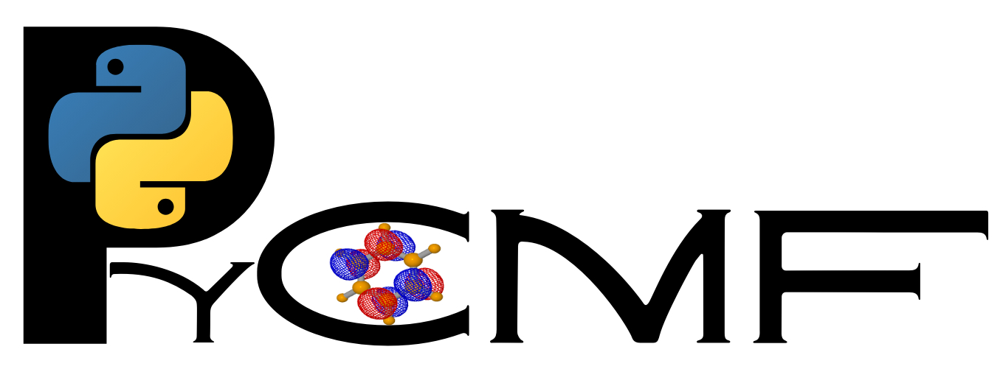

<div align="left">
  
</div>

# PyCMF

PyCMF is a Python package including correlated mean-field methods for molecules and materials. It is built on top of the PySCF library.

## Installation

### Step 1: Clone the Repository

Download to your local machine

```bash
git clone https://github.com/Quantum-Lab-HCMUS/pyCMF.git
cd pyCMF

```

*(Make sure you are inside the `pyCMF` root directory where the `pyproject.toml` file is located before proceeding to the next steps).*

### Step 2: Create a Minimal Conda Environment

It is highly recommended to isolate the dependencies of this project. Create a clean Conda environment with Python 3.11:

```bash
conda create -n pycmf python=3.11 -y

```

### Step 3: Activate the Environment

You must activate the environment before installing anything:

```bash
conda activate pycmf

```

*(You should see `(pycmf)` appear at the beginning of your terminal prompt).*

### Step 4: Install the Package in Editable Mode (Crucial Step)

Install `pyCMF` along with all its dependencies (`pyscf`, `opt_einsum`, `numpy`, `scipy`) by running the following command. **Do not forget the dot (`.`) at the end!**

```bash
pip install -e .

```
